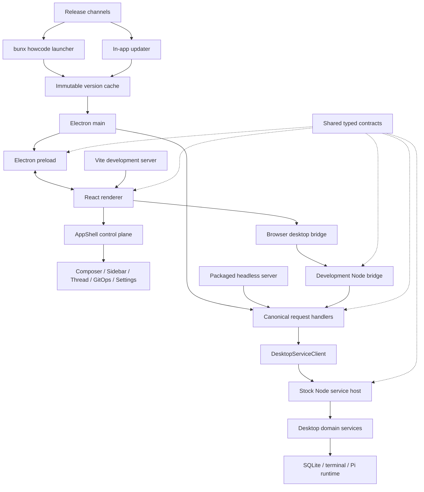

# Agent-native hardening

This is the durable ledger for making Howcode easier to change safely. Reread it before starting
each phase, after context compaction, and whenever the observed topology no longer matches the plan.
Update the evidence and phase log instead of relying on conversation history.

The work is optimisation only. Preserve application behaviour, product semantics, UI, UX, copy,
layout, and interaction. A behaviour change needs its own explicit scope; it must not sneak into a
structural pass.

## Product and runtime invariants

- Howcode is a single-user coding-agent GUI, not a generic editor or multiplayer review system.
- The renderer owns presentation and local interaction state. It does not own filesystem, process,
  persistence, updater, or Pi runtime behaviour.
- Electron owns window/headless transports and process lifecycle, not backend product logic.
- `src/desktop-host/*` owns the Electron/dev-to-stock-Node process boundary.
- `desktop/*` runs under discovered stock Node and owns backend domains, persistence, Pi runtimes,
  terminals, and native service dependencies.
- Cross-runtime contracts live in `shared/*`. Runtime layers import those contracts directly rather
  than through renderer compatibility files.
- Electron IPC, packaged headless HTTP, and development web transport expose equivalent typed
  operations through one canonical request implementation. Transport-specific authentication,
  framing, and platform capabilities remain adapters.
- ASAR stays enabled. Stock-Node code and native dependency trees remain outside it.
- React Doctor stays at 100. Hardening may not weaken Biome, TypeScript, tests, packaging, or native
  runtime validation.

## Current topology

### Main call flows

Renderer:

1. `src/main.tsx` installs the development bridge when needed and renders `src/app.tsx`.
2. `src/app/router-instance.ts` selects `AppShell` for all routes.
3. `src/app/app-shell.tsx` composes `useAppShellController` and `AppShellLayout`.
4. `src/app/app-shell/useAppShellController.ts` combines shell queries, workspace state, effects,
   desktop actions, commands, and feature view models.
5. Feature views receive the resulting controller or narrower values derived from it.

Packaged desktop:

1. `src/electron/main/index.ts` owns Electron startup, updater takeover, window/headless selection,
   desktop-service startup, and shutdown.
2. Windowed requests pass through preload and `src/electron/main/ipc/register-desktop-ipc.ts`.
3. Headless requests pass through `src/electron/main/headless/server.ts`.
4. Both use `src/electron/main/ipc/desktop-request-handlers.ts`.
5. `src/desktop-host/desktop-service-client.ts` is the Promise/class compatibility edge around the
   Effect-owned process lifecycle in `src/desktop-host/desktop-service/*`.
6. The stock-Node child enters through `desktop/service-host.ts` and delegates to `desktop/*`
   feature owners.

Development web:

1. `scripts/dev-web.ts` builds and starts Vite plus the development bridge child.
2. `src/app/dev-web-bridge.ts` exposes the browser-side desktop API.
3. HTTP/SSE requests reach `scripts/dev-web-bridge-node.ts`.
4. That script supplies browser capabilities to the same host-neutral request composition used by
   Electron and packaged headless before reaching `DesktopServiceClient`.

## Baseline evidence

Captured on `effect-v4` after commit `f6a04251`.

- Working tree clean.
- React Doctor: 100/100.
- Last full gate: 64 test files, 208 tests.
- Strict TypeScript covers renderer, desktop service, Electron/desktop host, and scripts.
- Source scan: roughly 74,000 TypeScript/TSX lines across the principal runtime and tooling roots.
- Renderer: 547 files. Largest areas are Composer at roughly 11,200 lines, AppShell at 8,000,
  sidebar/components at 7,300, and GitOps at 6,800.
- No explicit `any`, no TypeScript ignore directives, and 18 `as unknown as` compatibility casts.
- Static local-import scan found no cross-process implementation dependency from the stock-Node
  service into Electron or renderer code.
- The scan found six strongly connected component groups, listed below.
- The renderer has substantial cross-area traffic. A baseline static scan found 1,027 cross-area
  edges, including 935 relative imports. Many are legitimate composition or common-UI edges; the
  important problem is that intended direction is not mechanically distinguished from drift.

These are navigation signals, not automatic refactor instructions. File length alone does not make
a godfile. A large pure schema, mapper, or repository may be cohesive; mixed ownership and central
feature branching are the deciding evidence.

## Findings

### 1. Development transport duplicates production behaviour

Severity: high.

Resolved in Phase 2. The development bridge now composes the canonical host-neutral request
handlers and supplies only browser/platform capabilities.

Relevant files:

- `scripts/dev-web.ts`
- `scripts/dev-web-bridge-node.ts`
- `src/app/dev-web-bridge.ts`
- `src/electron/main/ipc/desktop-request-handlers.ts`
- `src/electron/main/headless/server.ts`
- `src/test/dev-web-bridge-api.test.ts`

Electron IPC and packaged headless already share a handler factory. Development has a separate,
hand-written `DesktopRequestHandlerMap`. The parity test compares browser API method names, not the
behaviour or complete request registry. This creates two places to implement or subtly alter every
desktop operation.

The transport scripts are godfile-class hotspots because they combine process lifecycle, HTTP/SSE,
authentication, uploads, static/proxy serving, request routing, and desktop operation behaviour.

Target shape:

- one host-neutral request implementation composed from domain-owned handler groups;
- small environment adapters for updater, dialogs, clipboard, system opening, and other real
  capability differences;
- Electron IPC, packaged headless, and development HTTP only authenticate/frame/forward;
- compile-time or deterministic registry parity, not source-text method-name comparison.

### 2. AppShell still owns too much feature state and effect coordination

Severity: high.

Resolved in Phase 3. AppShell now exposes named capability groups, feature views declare the groups
they consume, and feature-local state/action stages have narrow owners.

Relevant files:

- `src/app/app-shell/useAppShellController.ts`
- `src/app/app-shell/useAppShellStateBundle.ts`
- `src/app/app-shell/useDesktopActionHandlers.ts`
- `src/app/app-shell/useAppShellEffects.ts`
- `src/app/app-shell/controller-post-action-effects.ts`
- `src/app/state/workspace.ts`
- `src/app/state/workspace-action-handlers.ts`

The old root godfile has been decomposed into named modules, which is good. The ownership topology is
still broad: AppShell stores feature-local state, coordinates many independent effects, and returns
a large controller consumed deeply by unrelated feature views. The universal desktop action path
also knows optimistic update rules and post-effects for many domains.

Target shape:

- AppShell routes and composes truly global lifecycle only;
- grouped, feature-owned capabilities replace a flat controller prop surface;
- thread, project, composer, GitOps, settings, and extension state/effects live with those features;
- central action code performs typed routing and one invocation, while domain-owned pipelines own
  preparation, optimistic state, reconciliation, and error policy;
- workspace state represents navigation modes explicitly rather than relying on combinations of
  booleans and nullable fields where practical.

Preserve the historical project-selector target-highlight flow documented in the local AppShell and
sidebar guidance.

### 3. Six dependency cycles obscure ownership

Severity: medium.

Resolved in Phase 1. The baseline groups below are retained as evidence of what was removed.

The current strongly connected groups are:

1. Composer: `composer.tsx`, `composer-prompt-surface.tsx`,
   `composer-prompt-surface-helpers.ts`, and `composer-prompt-footer.tsx`.
2. Artifact shell: `useArtifactPanelState.ts`, `useArtifactSelection.ts`, `useArtifactSave.ts`, and
   `useArtifactDerivedState.ts`.
3. Workspace state: `workspace.ts`, `workspace-action-handlers.ts`, and
   `workspace-terminal-state.ts`.
4. Code workspace: `code-workspace-view.tsx`, `code-workspace-main-area.tsx`, and
   `code-workspace-footer.tsx`.
5. Shared contracts: `desktop-thread-contracts.ts`, `desktop-settings-contracts.ts`, and
   `desktop-project-git-contracts.ts`.
6. Session tree: `session-tree.ts` and `session-tree-mapper.ts`.

Most are type-ownership cycles rather than runtime recursion. Extract the smallest owned contract or
model needed to make direction acyclic. Do not introduce `types.ts` junk drawers.

### 4. Preload reaches through renderer compatibility files

Severity: medium.

Resolved in Phase 4. Preload now imports actions, desktop contracts, and terminal contracts directly
from `shared/*`.

`src/electron/preload/create-desktop-api.ts` imports action and API types through
`src/app/desktop/actions.ts` and `src/app/desktop/types.ts`. Those currently re-export `shared/*`, so
the emitted runtime is not coupled, but the dependency direction violates the cross-runtime rule.
Preload should consume `shared/*` directly.

### 5. Architecture guidance is not fully enforced

Severity: medium.

Resolved in Phase 4. The umbrella gate now rejects forbidden runtime-layer imports and production
dependency cycles from rules derived from the source roots and `tsconfig.json` aliases.

Nested `AGENTS.md` files and `@howcode/*` entrypoints document intended ownership. The existing Vite
resolution check proves aliases resolve, but it does not reject forbidden cross-runtime imports,
new cycles, or feature code bypassing a public entrypoint.

Add only narrow rules with clear independent oracles. Do not freeze the current whole import graph
or turn historical debt into an enormous allowlist.

### 6. Auxiliary deployables sit outside the umbrella gate

Severity: low.

Resolved in Phase 6. Pages and the polls worker now have strict type/build checks in `ai:check`, and
the architecture checker includes both isolated source roots.

## Baseline scorecard

| Category | Score | Evidence |
| --- | ---: | --- |
| `agent_native` | 5/10 | Strong feature folders and contracts; capped by duplicated transport ownership and central shell pressure. |
| `fully_typed` | 8/10 | Strict configs and typed cross-runtime maps; weakened by compatibility casts and flag-heavy root state. |
| `traversable` | 5/10 | Good names and local guidance; transport godfiles, broad root ownership, and six cycles raise reread cost. |
| `test_coverage` | 7/10 | Broad deterministic contract/domain coverage; limited full transport parity and UI integration coverage. |
| `feedback_loops` | 8/10 | Strong local gate and commit hooks; auxiliary deployables remain outside it. |
| `self_documenting` | 7/10 | High-signal local guidance and contracts; dependency direction remains clearer in prose than in structure. |

## Phases

Each phase is behaviour-preserving, separately committed, and followed by the smallest focused
checks during iteration. The commit hook runs the umbrella gate once. Update this section with the
commit and any changed evidence after every phase.

### Phase 0 — Baseline and durable map

Status: complete.

- Record topology, evidence, invariants, scorecard, and phases here.
- Tighten relevant local `AGENTS.md` files so the shortest future path follows the target design.
- No source behaviour changes.

Completion: commit `81ccfe5e`.

### Phase 1 — Remove dependency cycles

Status: complete.

- Extract feature-owned props/models/contracts for the six cycle groups.
- Keep public exports stable where existing consumers need them.
- Add no generic helpers and change no rendering or state transitions.
- Verify the local import graph is acyclic afterwards.

Validation: all four TypeScript lanes, local dependency-cycle scan, the commit gate, and Doctor.

Completion: commit `6262bec9`. Shared leaf models/contracts now own Composer props, artifact view
state, workspace state/actions, code-workspace props, GitOps mode, and session-tree rows. A static
scan of 857 production files reports zero local dependency cycles; all four TypeScript lanes pass.

### Phase 2 — Canonicalise desktop request behaviour

Status: complete.

- Trace every request capability across preload, packaged headless, and development web.
- Move operation behaviour into one host-neutral, typed handler composition boundary.
- Keep updater and platform-only capabilities behind explicit adapters.
- Reduce `scripts/dev-web.ts`, `scripts/dev-web-bridge-node.ts`, and
  `src/electron/main/headless/server.ts` to lifecycle and transport responsibilities.
- Replace source-text API parity with typed registry/capability parity.

Validation must cover Electron, development web, headless, uploads, events, updater stubs, terminal
RPC, shutdown, and authentication boundaries without changing external behaviour.

Completion: commit `c662f47f`. `src/desktop-host/desktop-requests/*` now owns the complete typed
request map. Electron and development provide updater/system capabilities; packaged headless keeps
using the Electron composition. Runtime operation mapping exists once. The development bridge fell
from 514 to 286 lines and the Electron system adapter from roughly 300 to 134 lines. All four
TypeScript lanes and a standalone development-bridge bundle pass.

### Phase 3 — Narrow AppShell ownership

Status: complete.

- Inventory the flat `AppShellController` surface by consuming feature.
- Introduce grouped capability objects only where they express real feature ownership.
- Move feature-local state and effects out of `useAppShellStateBundle` and universal action code.
- Keep AppShell as a small composition/router boundary.
- Preserve all current project selection, URL sync, terminal, takeover, optimistic update, and
  refresh behaviour.

Prefer several small vertical moves over replacing the whole controller at once.

Completion: commit `601c0f4f`. The flat controller became 14 named capability groups; sidebar,
chat, CodeWorkspace, and overlays declare narrowed group contracts. Thread, Composer, project, and
resource-scope state moved from the 29-field state bag into four owned hooks, leaving the bundle as
a 27-line composer. Desktop action preparation, optimistic routing, and error policy moved out of
the universal hook, reducing it from 310 to 190 lines while retaining one invocation and the same
post-effect order.

### Phase 4 — Enforce durable boundaries

Status: complete.

- Forbid Electron/preload imports through renderer implementation paths.
- Prevent new stock-Node-to-Electron/renderer implementation dependencies.
- Detect newly introduced local dependency cycles.
- Clarify public feature entrypoints where current ownership is already stable.
- Do not attempt a mass alias rewrite without a measurable ownership benefit.

Completion: commit `d1dabeab`. `scripts/check-architecture-boundaries.ts` scans 867 production
files, resolves relative and configured alias imports, rejects runtime layers pointing in the wrong
direction, and fails on strongly connected dependency groups. It is wired into `ai:check` without a
snapshot or historical allowlist. Electron preload now consumes `shared/*` directly.

### Phase 5 — Reassess hotspots and duplication

Status: complete.

- Rerun file size, fan-in/fan-out, cycle, cast, and cross-boundary scans.
- Inspect mixed-concern hotspots rather than mechanically splitting long cohesive files.
- Check Composer, AppShell, sidebar, GitOps, headless transport, dev transport, desktop action
  routing, shared contracts, and persistence repositories.
- Extract only when the resulting owner and validation boundary are clearer.

Completion: commit `5e975a88`. The mixed headless server was split into an 87-line lifecycle
entrypoint plus owned auth, bounded-response, and request-router modules; the former 577-line file
is gone. Development web host trust/authentication moved into `dev-web-access.ts`, reducing
`dev-web.ts` from 497 to 343 lines. Both transports retain the same tokens, cookies, status codes,
host/origin checks, proxying, uploads, SSE cleanup, and SPA fallback.

The reassessment deliberately retained several long cohesive files: SQLite query repositories,
pure Pi message/payload mappers, typed contract maps, project diff algorithms, and the workspace
transition registry. Their length is visible, but they do not currently mix runtime layers or hide
unowned side effects. Composer, sidebar, and GitOps already have feature-owned submodules and no
dependency cycles. Current scan: zero explicit `any`, zero TypeScript suppressions, 18 compatibility
casts, and zero forbidden boundaries/cycles across 871 production files.

### Phase 6 — Complete feedback loops and final stabilisation

Status: complete.

- Add explicit type/build checks for Pages and the polls worker.
- Run the complete app gate and packaged runtime/build smoke.
- Perform disposable browser/Electron smoke checks for the unchanged core workflows.
- Update the scorecard with before/after evidence and list only genuine remaining risks.

Completion: this phase's commit. `check:auxiliary` now strictly typechecks and production-builds the
Pages site and Cloudflare polls worker using official Worker/D1 types. Both roots are included in
the architecture boundary and cycle scan. Vite config loading is explicit and warning-free for the
root app and Pages build. A complete unpacked Electron build succeeded, including renderer/runtime
bundles, ASAR packaging, node-pty helper patching, and stock-Node service native bundles for ABIs
137, 141, and 147. The restarted development host passed HTTP authentication/root checks and a
server-browser smoke: the GitOps route rendered against the live desktop API. The desktop browser
host was unavailable over SSH, so no desktop-machine browser claim is made.

## Final scorecard

| Category | Before | After | Evidence |
| --- | ---: | ---: | --- |
| `agent_native` | 5/10 | 8/10 | Feature-owned controller capabilities, one desktop request pipeline, and enforced runtime direction replace central duplication; `src/app/app-shell/*` and `src/desktop-host/desktop-requests/*`. |
| `fully_typed` | 8/10 | 9/10 | Strict checks now cover every deployable, including `pages/tsconfig.json` and `workers/polls/tsconfig.json`; no explicit `any` or TypeScript suppressions remain. |
| `traversable` | 5/10 | 8/10 | Six cycles are gone, transport entrypoints are small, and local `AGENTS.md` files identify owners; some large cohesive domain modules remain. |
| `test_coverage` | 7/10 | 8/10 | 210 deterministic tests cover contracts, domains, transports, and trust failures; browser smoke covers the live development path, but there is no cross-platform Electron interaction matrix. |
| `feedback_loops` | 8/10 | 9/10 | The enforced commit gate now covers formatting, all TypeScript lanes, auxiliary builds, architecture, Vite resolution, tests, and React Doctor. |
| `self_documenting` | 7/10 | 8/10 | This map, boundary-local guidance, typed contracts, and named owners describe the actual topology without a parallel architecture-doc set. |

### Remaining risks

- The 18 compatibility casts are concentrated at runtime/third-party boundaries. They are visible
  debt, but replacing them without stronger upstream types would only move the assertions.
- Several long files remain intentionally cohesive: `desktop/thread-state-db/queries.ts`,
  `shared/pi-message-mapper.ts`, `shared/pi-thread-action-payloads.ts`, and
  `desktop/project-git/project-diff-baselines.ts`. Reassess if they start absorbing unrelated edits;
  length alone does not justify splitting their single-purpose maps and algorithms.
- Browser coverage is a deterministic smoke rather than a broad cross-platform E2E suite. Keep
  product contracts in unit/integration tests and use disposable UI smoke for high-risk workflows.
- The production renderer still emits a large-chunk warning. Treat code splitting as a measured
  startup/performance task, not an architecture refactor by assertion.

## Completion log

| Phase | Commit | Evidence |
| --- | --- | --- |
| 0 | `81ccfe5e` | Durable topology and hardening plan; no source changes. |
| 1 | `6262bec9` | Six strongly connected groups removed; zero local cycles across 857 production files. |
| 2 | `c662f47f` | One typed request implementation across Electron, headless, and development; dev bridge reduced by 228 lines. |
| 3 | `601c0f4f` | Flat shell controller replaced by 14 narrowed feature capabilities; state and action stages have named owners. |
| 4 | `d1dabeab` | Cross-runtime direction and zero-cycle topology enforced across 867 production files. |
| 5 | `5e975a88` | Headless and development hosts split by lifecycle, auth, response, and routing ownership. |
| 6 | This phase's commit | Auxiliary deployables joined the gate; full package build and live development browser smoke passed. |

## Stop conditions

Stop and reassess instead of pushing through when:

- a refactor requires changed copy, layout, interaction, persisted data, action semantics, or
  transport responses;
- a supposedly shared abstraction needs environment conditionals for unrelated capabilities;
- a new central registry starts accumulating feature logic rather than registration;
- a test protects current implementation shape rather than an independent contract;
- runtime parity cannot be proved from direct control-flow comparison;
- a phase grows beyond one coherent ownership change.
